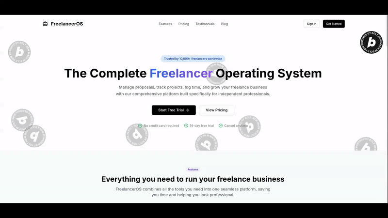

# FreelancerOS 🚀

> A comprehensive freelance management platform built with Next.js, Supabase, and modern web technologies.

[](https://bolt.new)
[](https://nextjs.org)
[](https://supabase.com)
[](https://netlify.com)
[](https://app.netlify.com/projects/freelanceros/deploys)




## 🎯 Overview

FreelancerOS revolutionizes how freelancers manage their business by providing a unified platform for proposal generation, project management, and client communication. Built entirely with Bolt.new for the World's Largest Hackathon 2025.

### ✨ Key Features

- **🤖 Smart Proposal Generation** - Create professional proposals with customizable templates
- **📊 Project Management** - Milestone-driven tracking with progress visualization
- **🔗 Secure Client Portals** - Auto-generated portals for real-time project visibility
- **⏱️ Time Tracking** - Manual entry with project/task association
- **📈 Analytics Dashboard** - Comprehensive insights and conversion metrics
- **🎨 Clean Design** - Monochrome aesthetic with light/dark theme support

## 🛠️ Tech Stack

- **Frontend**: Next.js 14 with TypeScript and App Router
- **Backend**: Supabase (Auth, Database, Real-time)
- **UI**: shadcn/ui components with TailwindCSS
- **State Management**: Zustand
- **Deployment**: Netlify
- **Development**: Bolt.new

## 🚀 Quick Start

### Prerequisites

- Node.js 18+ and npm
- Supabase account
- Netlify account (for deployment)

### Installation

1. **Clone the repository**
   ```bash
   git clone https://github.com/thenew-programer/freelanceros.git
   cd freelanceros
   ```

2. **Install dependencies**
   ```bash
   npm install
   ```

3. **Environment Setup**
   ```bash
   cp .env.example .env.local
   ```
   
   Fill in your Supabase credentials:
   ```env
   NEXT_PUBLIC_SUPABASE_URL=your_supabase_url
   NEXT_PUBLIC_SUPABASE_ANON_KEY=your_supabase_anon_key
   STRIPE_SECRET_KEY=your_stripe_key
   ```

4. **Database Setup**
   ```bash
   # Run Supabase migrations (if available)
   npx supabase db reset
   ```

5. **Start Development Server**
   ```bash
   npx next dev
   ```

   Open [http://localhost:3000](http://localhost:3000) in your browser.


## 🎨 Design System

FreelancerOS uses a clean monochrome design system:

- **Colors**: Black, white, and gray scale variants
- **Components**: shadcn/ui with custom black/white theme
- **Typography**: Clean, readable fonts with proper contrast
- **Layout**: Minimalist design focusing on content hierarchy

## 🔐 Authentication & Security

- **Supabase Auth** with email/password and social providers
- **Row Level Security (RLS)** for multi-tenant data isolation
- **Secure client portals** with link-based access (no signup required)

## 📊 Features Deep Dive

### Proposal Generation
- Customizable templates for different project types
- Technical recommendations and scope definition
- Professional formatting with branding options

### Project Management
- Convert proposals to trackable projects
- Milestone-based progress tracking
- Task management with time association

### Client Portals
- Auto-generated secure links for each project
- Real-time progress updates
- File sharing and communication

### Analytics
- Proposal conversion rates
- Project profitability tracking
- Client engagement metrics

## 🚀 Deployment

### Netlify Deployment

1. **Connect Repository**
   - Link your GitHub repository to Netlify
   - Configure build settings: `npm run build`

2. **Environment Variables**
   ```
   NEXT_PUBLIC_SUPABASE_URL=your_supabase_url
   NEXT_PUBLIC_SUPABASE_ANON_KEY=your_supabase_anon_key
   STRIPE_SECRET_KEY=your_stripe_key
   ```

3. **Deploy**
   - Automatic deployments on git push
   - Preview deployments for pull requests

## 🤝 Contributing

Contributions are welcome! Please feel free to submit a Pull Request.

1. Fork the project
2. Create your feature branch (`git checkout -b feature/AmazingFeature`)
3. Commit your changes (`git commit -m 'Add some AmazingFeature'`)
4. Push to the branch (`git push origin feature/AmazingFeature`)
5. Open a Pull Request

## 🏆 Hackathon Submission

This project was built for the **World's Largest Hackathon 2025** presented by Bolt. It demonstrates:

- Complete application built with Bolt.new
- Integration with Supabase for backend services
- Deployment on Netlify
- Real-world utility for freelancers
- Professional design and user experience

## 📝 License

This project is licensed under the MIT License - see the [LICENSE](LICENSE) file for details.

## 🙏 Acknowledgments

- Built with [Bolt.new](https://bolt.new) - AI-powered development platform
- [Supabase](https://supabase.com) - Backend as a Service
- [shadcn/ui](https://ui.shadcn.com) - Beautiful component library
- [Next.js](https://nextjs.org) - React framework
- [Netlify](https://netlify.com) - Deployment platform

## 📧 Contact

Built by [Joseph Bouryal] - [@youssef_bouryal](https://twitter.com/youssef_bouryal)

Project Link: [https://github.com/thenew-programer/freelanceros](https://github.com/thenew-programer/freelanceros)

Live Demo: [https://freelanceros.netlify.app](https://freelanceros.netlify.app)

---

⭐ **If you find this project useful, please give it a star!** ⭐
